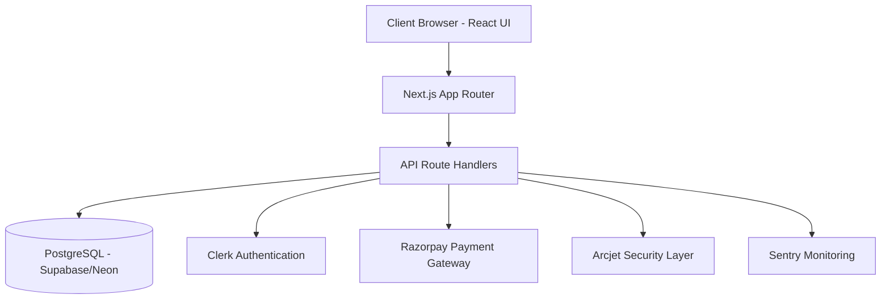
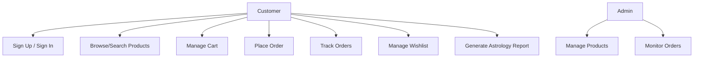
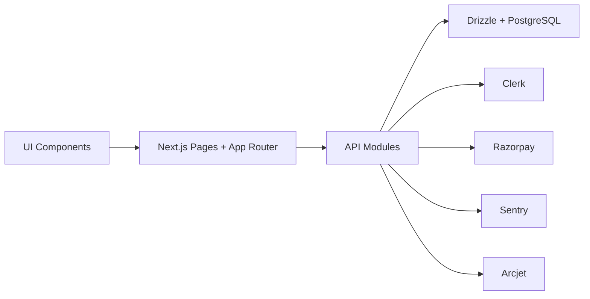

# Spiritual Store - PPT Content Guide

This document provides ready-to-use slide content for project presentation.

## Slide 1: Title Slide

**Title:** Spiritual Store - Full Stack E-commerce Platform for Spiritual and Wellness Products  
**Subtitle:** Scalable, Secure, and Feature-Rich Web Application  
**Tech Snapshot:** Next.js 16, React 19, TypeScript, Supabase/PostgreSQL, Drizzle ORM, Clerk, Razorpay, Sentry, Arcjet

**Media / Image Suggestion:**

- Use a clean title slide with a spiritual-themed ecommerce mockup, soft gradients, product imagery, and a subtle dashboard or website screenshot.
- Add the project logo or brand name prominently in the center with a premium modern layout.

---

## Slide 2: Project Overview

- Spiritual Store is a modern web-based e-commerce platform focused on spiritual and wellness products.
- It supports complete user journeys: product discovery, cart, checkout, payment verification, and order tracking.
- The platform includes additional domain features such as astrology reports, wishlist, and service modules.
- System design emphasizes security, modularity, maintainability, and production readiness.

**One-line overview for viva:**  
"Spiritual Store is a niche e-commerce platform built with modern full-stack web technologies to deliver secure shopping and personalized spiritual services at scale."

**Media / Image Suggestion:**

- Show a homepage screenshot with product cards, categories, and a visible search or hero section.
- A collage of spiritual products such as crystals, incense, meditation items, and wellness accessories works well here.

---

## Slide 3: Problem Statement

- Generic e-commerce templates do not address niche workflows in the spiritual/wellness market.
- Users need trust-first experiences: secure authentication, safe payments, and reliable order status.
- Performance and usability are essential for retention across mobile and desktop.
- Growing product catalogs and concurrent orders require robust backend architecture and optimized queries.

**Core problem statement:**  
"How can we build a secure and scalable niche e-commerce solution that combines product commerce with personalized spiritual services while maintaining excellent user experience?"

**Media / Image Suggestion:**

- Use an infographic-style image showing common ecommerce pain points like generic design, weak security, slow checkout, and poor personalization.
- A split-screen comparison between a generic store and the proposed spiritual store can visually support this slide.

---

## Slide 4: Introduction

- The project is built using the App Router architecture in Next.js with a component-driven React frontend.
- Backend logic is implemented through Next.js API route handlers.
- Type-safe data access is achieved via Drizzle ORM over PostgreSQL.
- Third-party integrations: Clerk (auth), Razorpay (payments), Sentry (observability), Arcjet (API protection).

**Why this project matters:**

- Bridges domain-specific user needs with enterprise-grade web engineering practices.
- Demonstrates practical full-stack design with production-level integrations.

**Media / Image Suggestion:**

- Include a simple frontend-to-backend architecture snapshot or a layered web app illustration.
- A screenshot of the app with a short caption like "Modern spiritual shopping experience powered by full-stack web engineering" fits this slide.

---

## Slide 5: Existing Solutions / Literature Survey

### Existing Solutions

- Marketplace platforms (general e-commerce): broad functionality but weak domain personalization.
- CMS/plugin-based stores: fast setup but limited scalability and inconsistent type safety.
- Monolithic custom apps: high control but slower iteration and higher maintenance overhead.

### Literature/Industry Patterns Considered

- Modern JAMStack and hybrid rendering for performance.
- Managed authentication and payment services for reliability.
- API-first modular architecture for maintainability.
- Observability-first production practices (error and performance monitoring).

### Gap Identified

- Few solutions combine spiritual domain features (reports/services) with robust commerce workflows in one coherent system.

**Media / Image Suggestion:**

- Add a literature survey comparison table graphic or a chart showing the gap between generic ecommerce systems and domain-specific spiritual stores.
- You can also use icons for personalization, security, and scalability.

---

## Slide 6: Background & Related Work / Literature Review

- E-commerce best practices emphasize fast page loads, clear checkout, secure payment, and trust signals.
- Recent web engineering trends validate:
  - server-side rendering + selective client interactivity,
  - strict typing for runtime defect reduction,
  - API hardening via rate limits and bot detection,
  - proactive monitoring and incident-driven maintenance.
- This project applies those principles to a domain-focused store and extends it with astrology and service workflows.

**Media / Image Suggestion:**

- Use a literature review visual with icons for SSR, type safety, payment security, monitoring, and modular components.
- A process diagram showing how the study influenced the project design would work well.

---

## Slide 7: Project Objectives

1. Build an end-to-end e-commerce platform for spiritual and wellness offerings.
2. Ensure secure user access and transaction flows.
3. Provide maintainable, modular, and type-safe code architecture.
4. Support scalability with serverless-compatible deployment patterns.
5. Enable additional user-value modules (astrology reports, wishlist, service discovery).
6. Maintain production observability and resilience.

**Media / Image Suggestion:**

- Insert an objective roadmap graphic with six milestones or icons matching the six objectives.
- A clean checklist-style visual can make this slide easy to follow.

---

## Slide 8: Proposed Solution (System Architecture)

### High-Level Architecture

### Architecture Notes

- Frontend and backend are unified in one Next.js codebase.
- API routes implement business logic and validation.
- Database persistence is handled through Drizzle ORM.
- Security and observability are integrated as first-class concerns.

**Media / Image Suggestion:**

- Use a system architecture diagram showing client, Next.js app, API routes, database, auth, payment, security, and monitoring.
- A polished block diagram or Mermaid-exported graphic will be ideal.

---

## Slide 9: Proposed Solution (Workflow)

### Key Workflow Strengths

- Clean and traceable checkout lifecycle.
- Server-side verification before order finalization.
- Failure handling hooks for payment and API errors.

**Media / Image Suggestion:**

- Add a workflow flowchart image from browse-to-order-confirmation.
- Highlight the payment verification stage with a different color or icon.

---

## Slide 10: UML (Use Case + Component View)

### Use Case Diagram (Mermaid)

### Component Diagram (Mermaid)

**Media / Image Suggestion:**

- Use two visuals side by side: a use case diagram and a component diagram.
- If space is limited, place one UML diagram per slide and keep the text minimal.

---

## Slide 11: Key Components / Features / Modules

### Core Commerce Modules

- Product Catalog and Product Details
- Shopping Cart Management
- Checkout and Payment Verification
- Order Management and Order History

### Value-Added Modules

- Wishlist Management
- Astrology and Report Generation flows
- Service pages and consultation-related modules
- Location-search API module

### Platform Modules

- Authentication and route protection
- API layer and business logic handlers
- Database schema and migrations
- Monitoring and incident tracking

**Media / Image Suggestion:**

- Show a module map or grid of feature icons for shop, cart, checkout, wishlist, reports, security, and monitoring.
- A UI collage with small screenshots from the main modules is also effective.

---

## Slide 12: Algorithms / Technologies / Frameworks / Tools Used

### Frameworks and Runtime

- Next.js 16.1.3, React 19, TypeScript

### Database and ORM

- PostgreSQL (Supabase/Neon ecosystem)
- Drizzle ORM and Drizzle Kit migrations

### Security and Reliability

- Clerk for authentication and session management
- Arcjet for rate limiting and bot protection
- Sentry for error/performance monitoring

### Payment

- Razorpay integration with payment verification workflow

### Styling and State

- Tailwind CSS, UI component primitives
- Zustand for lightweight state management

**Media / Image Suggestion:**

- Display a technology stack collage with framework logos or a stack diagram.
- Use icons for Next.js, React, TypeScript, PostgreSQL, Clerk, Razorpay, Sentry, and Arcjet.

---

## Slide 13: Dataset Descriptions / Input-Output Descriptions

### Dataset Description (Application Data)

- Product data: title, category, price, stock, image, description
- User data: profile, authentication identifiers
- Cart data: product-user mapping and quantities
- Order data: order items, payment status, timestamps
- Wishlist data: saved user-product relations
- Report data: generated astrology report entries

### Input-Output Description

- Input examples:
  - Product filters, search text, cart quantity, checkout details
  - Payment metadata from Razorpay callbacks
  - Birth details for astrology report generation
- Output examples:
  - Product listings and details
  - Order confirmation and status
  - Verified payment response
  - Generated astrology report content

**Media / Image Suggestion:**

- Add a simple input-output data flow graphic or database entity cards.
- You can also show sample form fields on one side and generated outputs on the other.

---

## Slide 14: Parameter Descriptions / Initial Conditions

### Key Parameters

- Authentication status (signed-in/signed-out)
- Product stock quantity and availability
- Cart item quantity and pricing totals
- Payment/order identifiers for verification
- API request payload validation fields

### Initial Conditions

- Valid environment configuration (DB, auth, payment, monitoring keys)
- Migrated database schema with seed data
- User authenticated for protected flows (cart, orders, reports)
- Product catalog loaded in database before purchase workflow

**Media / Image Suggestion:**

- Use a parameter table screenshot, a settings panel mockup, or a form validation illustration.
- A small "initial state vs. runtime state" graphic works well for this slide.

---

## Slide 15: Implementation Outcomes

### Functional Outcomes

- Implemented end-to-end commerce journey from browsing to verified payment.
- Added user-focused modules beyond baseline e-commerce (wishlist + astrology reports).
- Integrated production-grade auth, security, and monitoring stack.

### Suggested Table for PPT

| Module                | Status    | Notes                              |
| --------------------- | --------- | ---------------------------------- |
| Product & Shop        | Completed | Listing, details, category filters |
| Cart & Checkout       | Completed | Cart APIs and checkout flow        |
| Payment               | Completed | Razorpay + verification endpoint   |
| Orders                | Completed | User order retrieval and status    |
| Wishlist              | Completed | Save/remove item workflow          |
| Reports               | Completed | Astrology report generation flow   |
| Security & Monitoring | Completed | Arcjet + Sentry integrated         |

### Suggested Figures/UI Snaps to include in PPT

- Home page and product listing page
- Product details page
- Cart and checkout screen
- Razorpay payment modal/success state
- Orders and wishlist pages
- Rashi/report page

**Media / Image Suggestion:**

- Place one summary dashboard image showing implementation status and a second strip of actual UI screenshots.
- If using a collage, keep captions short: Home, Product, Cart, Checkout, Orders, Wishlist, Reports.

---

## Slide 16: Key Findings

- Unified full-stack architecture improved development speed and consistency.
- Managed integrations (auth/payment/monitoring) reduced infrastructure burden.
- Type safety and modular components improved maintainability.
- Security and observability layers are essential in transaction-heavy systems.
- Domain-specific modules increase differentiation over generic store templates.

**Media / Image Suggestion:**

- Use an insight card layout with icons for speed, security, modularity, and differentiation.
- A bar chart or benefit summary diagram can support the findings visually.

---

## Slide 17: Limitations

- No native mobile application yet (web-first implementation).
- Advanced recommendation/personalization models are still limited.
- Heavy dependence on third-party services introduces external service risk.
- Full-scale benchmark and load-test reporting can be further expanded.
- Some advanced admin analytics features are pending.

**Media / Image Suggestion:**

- Include a limitation callout graphic with warning icons and short labels for each constraint.
- Keep the style professional and factual rather than negative.

---

## Slide 18: Future Directions

### Short Term

- Advanced product recommendation engine.
- Enhanced review/rating and customer engagement workflows.
- Richer admin inventory controls and analytics.

### Medium Term

- Marketplace model for multi-vendor onboarding.
- Improved search with semantic/vector capabilities.
- Loyalty and subscription-based offerings.

### Long Term

- Native mobile app (React Native/Flutter).
- AI-powered support assistant.
- Multi-language, multi-currency global rollout.

**Media / Image Suggestion:**

- Show a future roadmap timeline with short-, medium-, and long-term milestones.
- A forward-looking illustration with mobile app, AI chatbot, and global commerce icons works well.

---

## Slide 19: Conclusion

- Spiritual Store demonstrates a practical, production-oriented implementation of a niche e-commerce system.
- The architecture balances user experience, scalability, security, and maintainability.
- The project is a strong foundation for future feature growth and real-world deployment at scale.

**Media / Image Suggestion:**

- Use a closing slide with a strong product screenshot or architecture collage.
- A simple final thank-you slide with the store brand or a spiritual visual can make the presentation memorable.

---

## Viva/Question Bank (Quick Answers)

### Q1. What is unique about this project?

- It combines a robust commerce engine with spiritual-domain modules (reports/services) in one integrated platform.

### Q2. Why did you choose Next.js + TypeScript?

- To get full-stack capability, strong typing, and better maintainability in a single codebase.

### Q3. How is payment safety handled?

- Payment is initiated via Razorpay and verified server-side before updating order status.

### Q4. How do you ensure reliability?

- By integrating monitoring (Sentry), API protection (Arcjet), and structured module-based architecture.

### Q5. What are your next major upgrades?

- Recommendation engine, advanced analytics, mobile app, and global-ready commerce features.
