# Spiritual Store - UML & Component Diagrams

Comprehensive collection of UML and component diagrams for the Spiritual Store project architecture, design patterns, and system interactions.

---

## Table of Contents

1. [Use Case Diagram](#use-case-diagram)
2. [Component Diagram](#component-diagram)
3. [Class Diagram (Entity Model)](#class-diagram-entity-model)
4. [Sequence Diagrams](#sequence-diagrams)
   - [Checkout & Payment Flow](#checkout--payment-flow-sequence)
   - [Authentication Flow](#authentication-flow-sequence)
   - [Astrology Report Generation](#astrology-report-generation-sequence)
5. [State Diagrams](#state-diagrams)
   - [Order State Machine](#order-state-machine)
   - [Payment State Machine](#payment-state-machine)
6. [Activity Diagrams](#activity-diagrams)
   - [User Registration Flow](#user-registration-flow-activity)
   - [Product Purchase Workflow](#product-purchase-workflow-activity)
7. [Entity Relationship Diagram](#entity-relationship-diagram)
8. [System Architecture Diagram](#system-architecture-diagram)
9. [Deployment Diagram](#deployment-diagram)

---

## Use Case Diagram

Shows all actors (users/systems) and their interactions with the Spiritual Store platform.

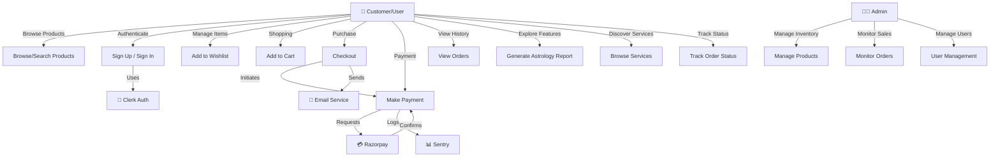

### Use Case Details

| Use Case                  | Actor    | Description                                 |
| ------------------------- | -------- | ------------------------------------------- |
| Browse/Search Products    | Customer | Search, filter, and browse product catalog  |
| Sign Up / Sign In         | Customer | Register or authenticate via Clerk          |
| Add to Wishlist           | Customer | Save products for later viewing             |
| Add to Cart               | Customer | Select products and quantities for purchase |
| Checkout                  | Customer | Review cart, enter shipping, initiate order |
| Make Payment              | Customer | Process payment via Razorpay gateway        |
| View Orders               | Customer | Access order history and details            |
| Generate Astrology Report | Customer | Create personalized astrology insights      |
| Browse Services           | Customer | Discover consultation and service offerings |
| Track Order Status        | Customer | Monitor order fulfillment progress          |
| Manage Products           | Admin    | CRUD operations on product catalog          |
| Monitor Orders            | Admin    | View and manage customer orders             |
| User Management           | Admin    | Handle user accounts and permissions        |

---

## Component Diagram

Shows high-level system components and their dependencies.

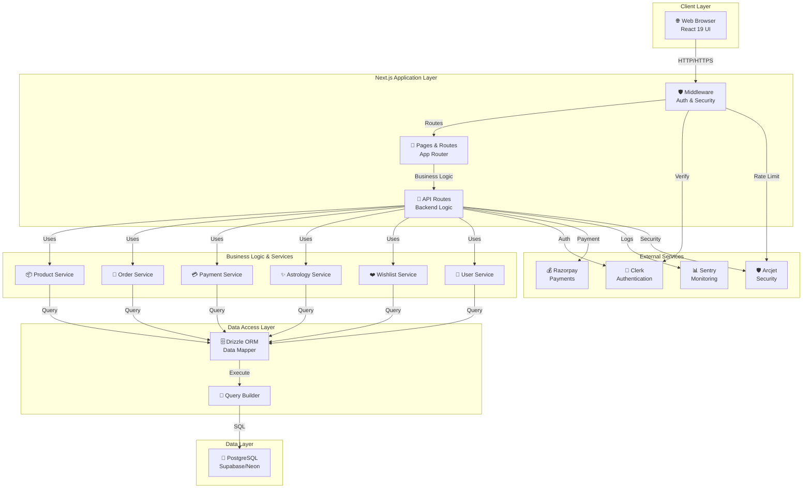

### Component Responsibilities

| Component         | Responsibility                                           |
| ----------------- | -------------------------------------------------------- |
| Web Browser       | Renders React components, handles user interactions      |
| Pages & Routes    | Render server-side pages and client-side navigation      |
| API Routes        | Handle HTTP requests and business logic                  |
| Middleware        | Authentication verification, CORS, request preprocessing |
| Product Service   | Product catalog, search, filtering, inventory            |
| Order Service     | Order creation, management, status tracking              |
| Payment Service   | Payment processing, verification, webhook handling       |
| Astrology Service | Report generation, calculations, storage                 |
| Wishlist Service  | Add/remove items, retrieve user wishlist                 |
| User Service      | Profile management, preferences, authentication sync     |
| Drizzle ORM       | Type-safe database access and query building             |
| PostgreSQL        | Persistent data storage with full ACID support           |
| Clerk             | User authentication and session management               |
| Razorpay          | Payment processing and verification                      |
| Sentry            | Error tracking and performance monitoring                |
| Arcjet            | API rate limiting and bot detection                      |

---

## Class Diagram (Entity Model)

Shows data models and their relationships.

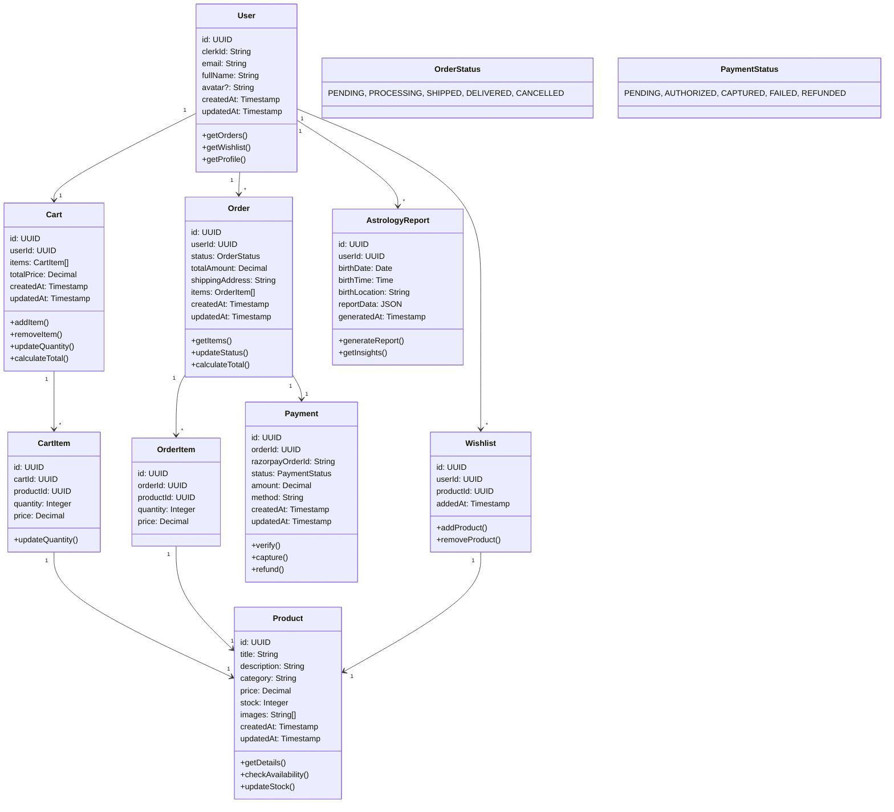

### Entity Descriptions

- **User**: Represents a customer with authentication via Clerk
- **Product**: Represents items available for purchase
- **Cart**: Temporary shopping cart for a user session
- **CartItem**: Individual items in a cart with quantity
- **Order**: Finalized purchase with items and shipping information
- **OrderItem**: Line items in an order with pricing snapshot
- **Payment**: Payment transaction tracking and status
- **Wishlist**: User-saved products for future purchase
- **AstrologyReport**: Generated personalized astrology insights

---

## Sequence Diagrams

### Checkout & Payment Flow (Sequence)

Shows the detailed interaction sequence during checkout and payment.

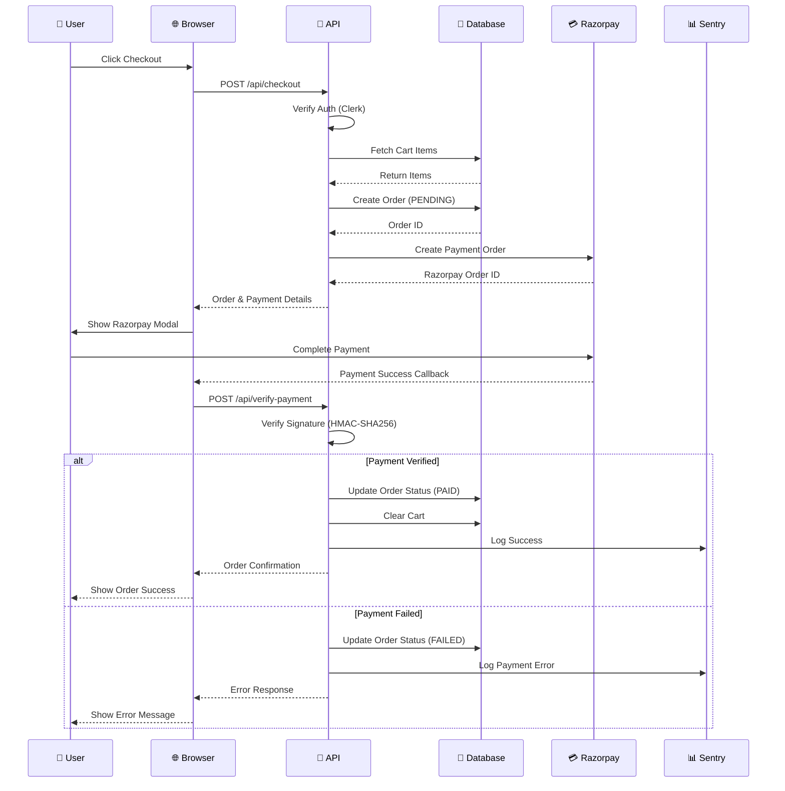

### Authentication Flow (Sequence)

Shows user authentication and session management.

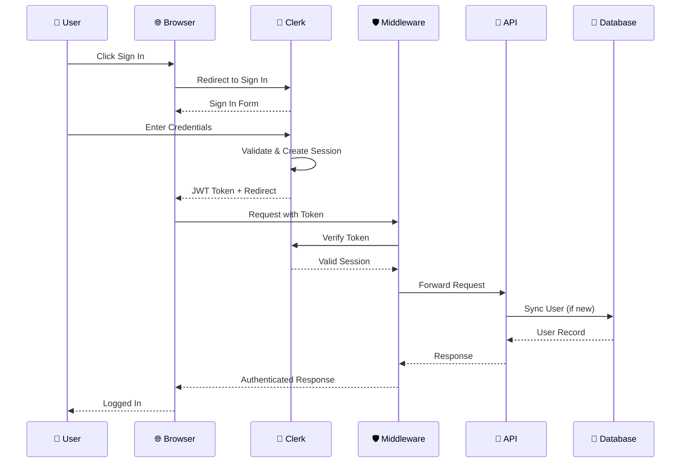

### Astrology Report Generation (Sequence)

Shows the flow of generating personalized astrology reports.

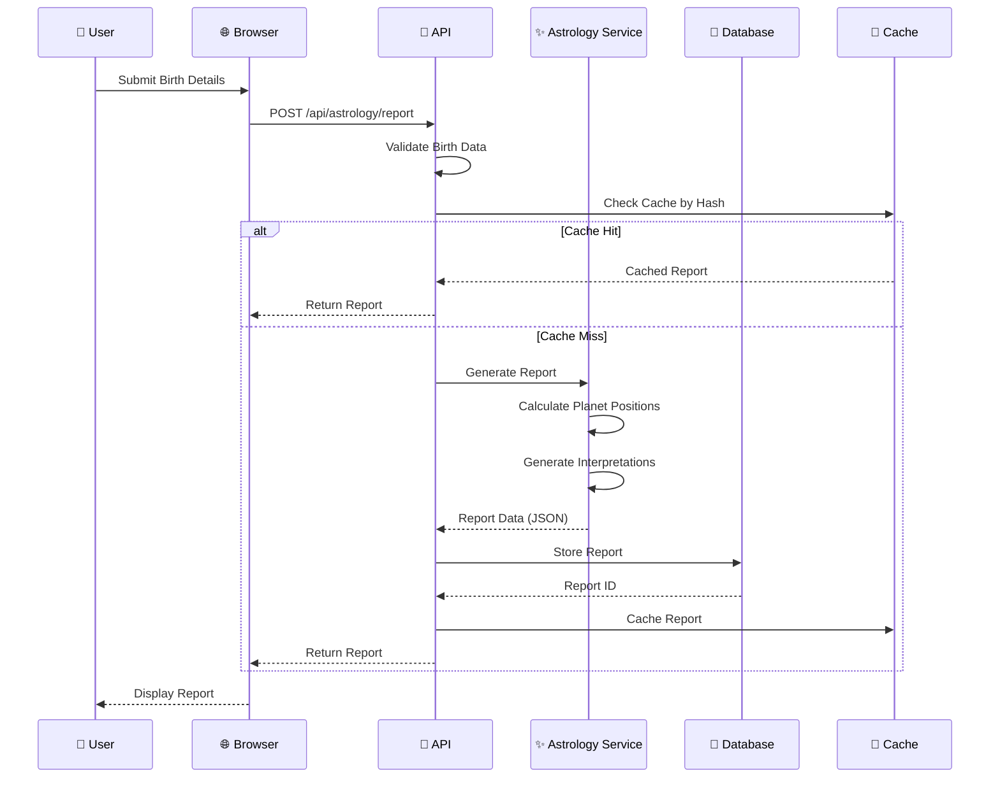

---

## State Diagrams

### Order State Machine

Shows all possible states and transitions for an order.

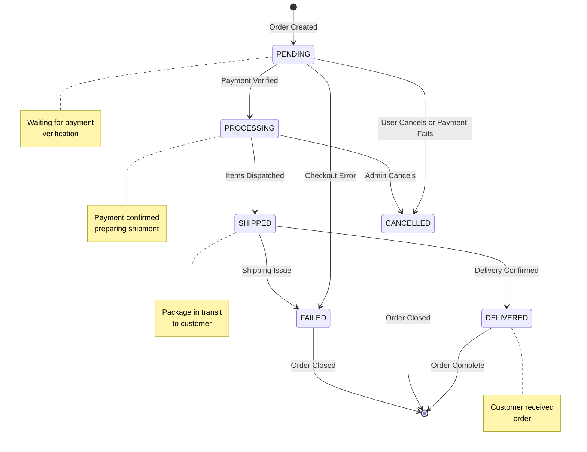

### Payment State Machine

Shows all payment states and transitions.

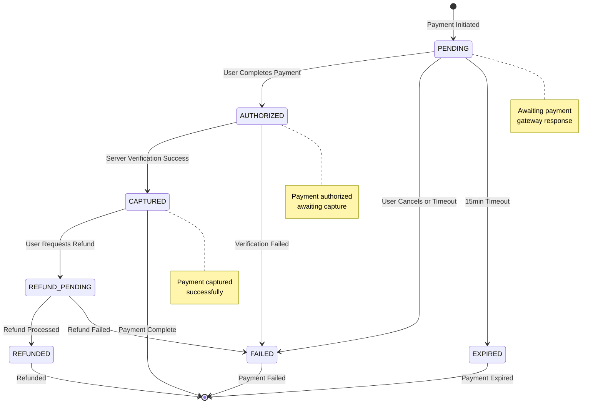

---

## Activity Diagrams

### User Registration Flow (Activity)

Shows the step-by-step user registration process.

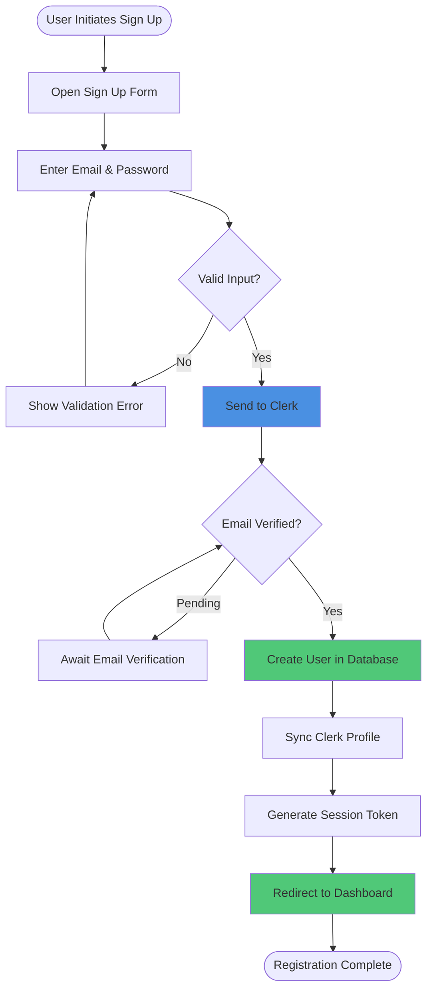

### Product Purchase Workflow (Activity)

Shows the complete purchase workflow from browsing to order confirmation.

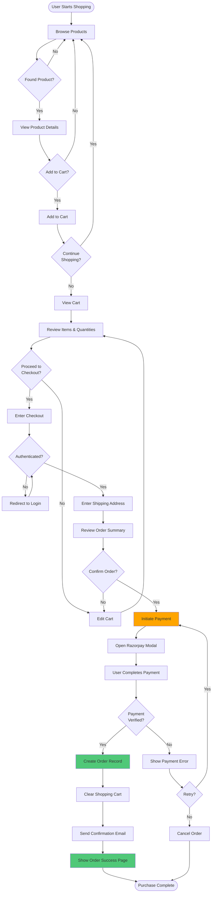

---

## Entity Relationship Diagram

Shows database table relationships and constraints.

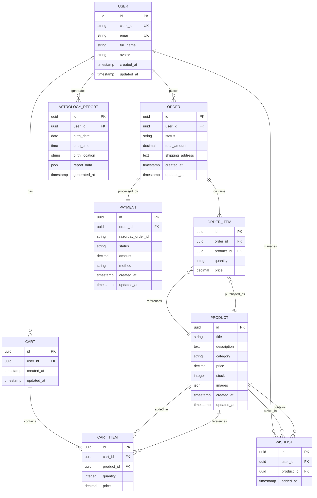

---

## System Architecture Diagram

Shows the complete system architecture with all layers and services.

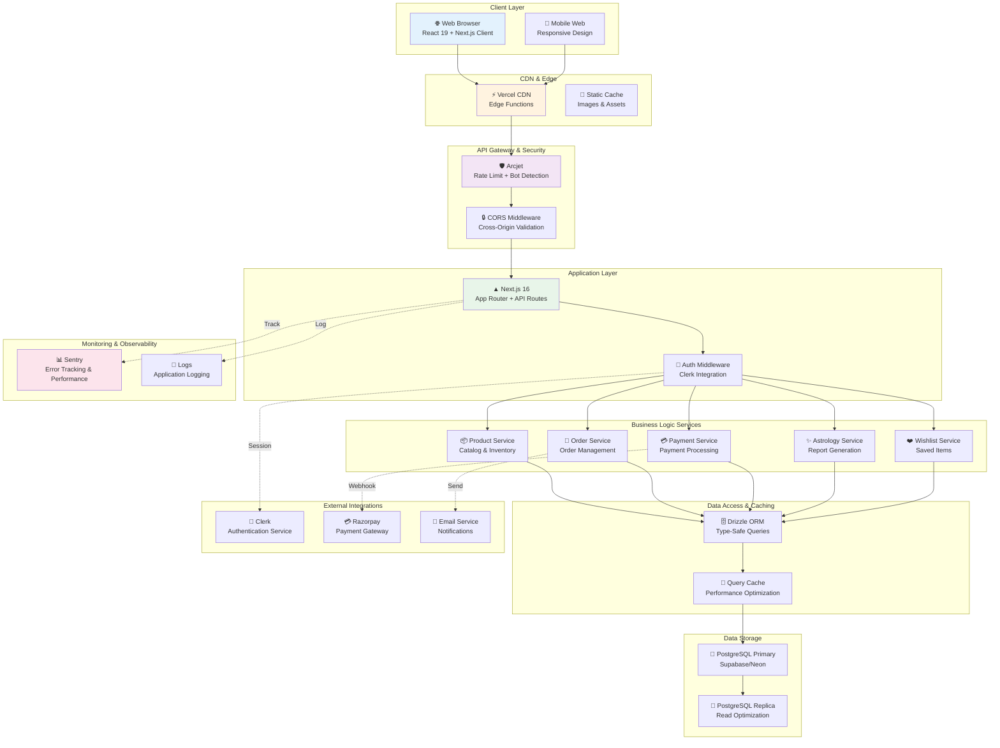

---

## Deployment Diagram

Shows how the system is deployed across services and infrastructure.

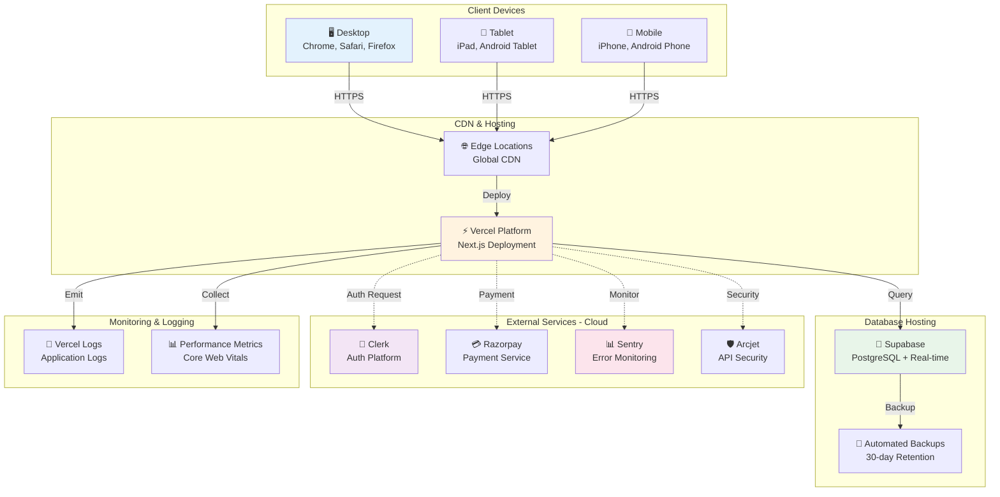

---

## Diagram Export & Usage Notes

### For PowerPoint/Presentation

1. **Export Mermaid Diagrams**: Use online Mermaid editor (https://mermaid.live) to:
   - Copy each diagram code
   - Export as PNG or SVG
   - Adjust styling/colors as needed

2. **Recommended Slide Assignments**:
   - Slide 1: System Architecture Diagram
   - Slide 2: Use Case Diagram
   - Slide 3: Component Diagram
   - Slide 4: Class/Entity Diagram
   - Slide 5: Checkout Sequence Diagram
   - Slide 6: Order State Machine
   - Slide 7: Payment State Machine

3. **Color Scheme for Custom Styling**:
   - Primary: `#1976d2` (Blue)
   - Success: `#388e3c` (Green)
   - Warning: `#f57c00` (Orange)
   - Error: `#d32f2f` (Red)
   - Secondary: `#7b1fa2` (Purple)

### For Documentation

- Each diagram includes detailed descriptions
- Cross-references between diagrams show relationships
- State machines clarify business logic
- Sequence diagrams show interaction protocols

### For Development

- Class diagram provides database schema reference
- Component diagram shows API module organization
- Activity diagrams clarify user workflows
- ERD helps with query optimization

---

## Quick Reference: Diagram Types Explained

| Diagram Type            | Purpose                                         | Use Case                                     |
| ----------------------- | ----------------------------------------------- | -------------------------------------------- |
| **Use Case**            | Shows actors and their interactions with system | Planning features, stakeholder communication |
| **Component**           | Shows system modules and dependencies           | Architecture review, module responsibilities |
| **Class/Entity**        | Shows data structure and relationships          | Database design, data model validation       |
| **Sequence**            | Shows message flow over time                    | Understanding workflows, debugging           |
| **State**               | Shows possible states and transitions           | Business logic, status tracking              |
| **Activity**            | Shows process flow step-by-step                 | User workflows, decision trees               |
| **Entity Relationship** | Shows database table relationships              | Database design, constraint definition       |
| **System Architecture** | Shows complete system structure                 | System overview, deployment planning         |
| **Deployment**          | Shows infrastructure and services               | DevOps, CI/CD planning                       |

---

**Last Updated**: May 8, 2026  
**Format**: Mermaid-compatible Markdown  
**For Use With**: PowerPoint, Documentation, Architecture Reviews, Team Presentations
